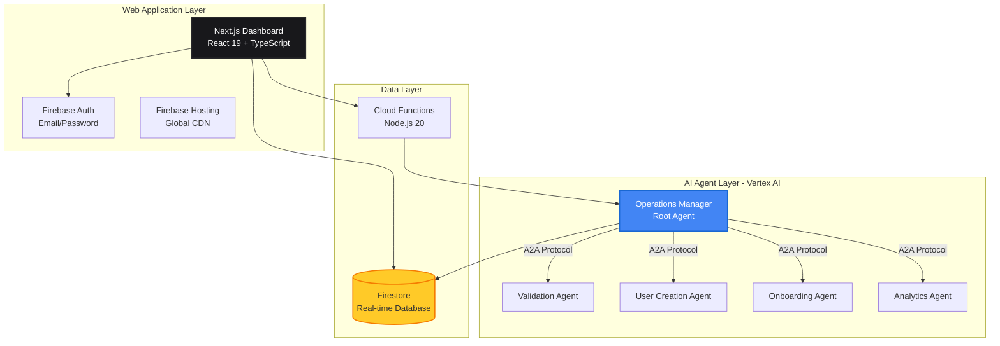
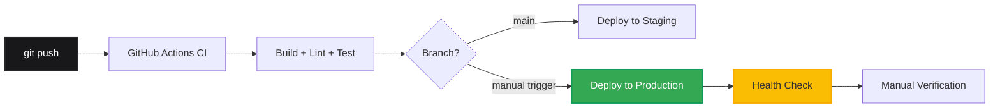

# ⚽ Hustle

[](https://nextjs.org/)
[](https://firebase.google.com/)
[](https://cloud.google.com/vertex-ai)
[](https://www.typescriptlang.org/)
[](https://firebase.google.com/docs/firestore)
[](./LICENSE)

**Youth Soccer Statistics Tracking Platform**

Empower youth athletes with comprehensive performance tracking, position-specific statistics, and real-time insights powered by Firebase and Vertex AI.

[Live Dashboard](https://hustlestats.io) • [GitHub Pages](https://jeremylongshore.github.io/hustle/) • [Architecture Guide](./CLAUDE.md)

---

## What is Hustle?

Hustle is a modern youth soccer statistics platform designed for parents, coaches, and players. Track performance across **13 specialized positions**, log game statistics, and gain insights that matter—all with a mobile-first, real-time experience.

Built on Firebase with Vertex AI agent orchestration, Hustle delivers professional-grade analytics while maintaining simplicity and speed for families on the go.

### Why Hustle?

- **Position Intelligence**: Track stats that matter for your child's actual position (GK, CB, CM, ST, etc.)
- **League Coverage**: Support for 56 U.S. youth soccer leagues including ECNL, MLS Next, USYS, Rush Soccer
- **Real-Time Sync**: Firestore-powered updates across all devices
- **Parent-Focused**: COPPA-compliant design with parent/guardian controls
- **Always Available**: Mobile-responsive design, offline-ready progressive web app

---

## Key Features

### Core Statistics Tracking
- **13 Soccer Positions**: Goalkeeper, Center Back, Right/Left Back, Wing Backs, Defensive/Central/Attacking Midfielders, Wingers, Strikers, Center Forward
- **Position-Specific Stats**: Saves, tackles, passes, shots, assists, goals—tailored to each role
- **Game Logging**: Quick capture of match performance with date, opponent, result
- **Performance Dashboard**: Visual analytics and trend tracking over time

### League & Player Management
- **56 Youth Leagues**: ECNL Girls/Boys, MLS Next, USYS, NPL, USSSA, Rush Soccer, Surf Soccer, and more
- **Custom Leagues**: "Other" option with free-text for regional/local leagues
- **Multi-Player Support**: Track multiple children from one parent account
- **Profile Enrichment**: Gender, primary/secondary positions, team/club affiliation

### Technology Foundation
- **Firebase Auth**: Secure email/password authentication
- **Firestore Database**: Real-time NoSQL data sync with hierarchical collections
- **Cloud Functions**: Serverless backend for business logic
- **Vertex AI Agents**: Multi-agent A2A orchestration for operations
- **Next.js 15**: React Server Components, App Router, Turbopack bundling

---

## System Architecture

Hustle consists of three integrated systems working in harmony:



### Data Model (Firestore)

```mermaid
graph LR
    Users[users/{userId}] --> Players[players/{playerId}]
    Players --> Games[games/{gameId}]

    Users -.->|Profile| UserData[email, name<br/>agreedToTerms<br/>isParentGuardian]
    Players -.->|Profile| PlayerData[name, birthday<br/>gender, positions<br/>league, team/club]
    Games -.->|Statistics| GameData[date, opponent<br/>position-specific stats<br/>result, notes]

    style Users fill:#18181b,stroke:#27272a,stroke-width:2px,color:#fff
    style Players fill:#4285F4,stroke:#1967D2,stroke-width:2px,color:#fff
    style Games fill:#34A853,stroke:#0F9D58,stroke-width:2px,color:#fff
```

**Security Model:**
- Firestore security rules enforce parent-child ownership
- Users can only read/write their own players and games
- COPPA compliance with parent/guardian verification

---

## Technology Stack

| Layer | Technologies |
|-------|-------------|
| **Frontend** | Next.js 15.5, React 19.1, TypeScript 5.x, Tailwind CSS, shadcn/ui |
| **Backend** | Firebase Cloud Functions (Node.js 20), Next.js API Routes |
| **Database** | Firestore (primary), hierarchical collections with subcollections |
| **Authentication** | Firebase Authentication (Email/Password) |
| **AI/ML** | Vertex AI Agent Engine, A2A Protocol, Google ADK |
| **Hosting** | Firebase Hosting (static assets), Cloud Run (SSR) |
| **Testing** | Vitest (unit), Playwright (E2E), Testing Library |
| **DevOps** | GitHub Actions, Workload Identity Federation (WIF), Terraform |
| **Monitoring** | Google Cloud Logging, Firebase Performance Monitoring, Error Reporting |

### Agent-to-Agent (A2A) Architecture

Hustle employs **5 specialized Vertex AI agents** coordinated via Google's A2A protocol:

1. **Operations Manager (Orchestrator)**: Root agent coordinating all operations
2. **Validation Agent**: Data quality and schema validation
3. **User Creation Agent**: Automated user provisioning workflows
4. **Onboarding Agent**: New user experience and setup flows
5. **Analytics Agent**: Performance metrics and insights generation

All agents communicate through Cloud Functions acting as the A2A gateway, maintaining session state via Vertex AI Memory Bank.

---

## Quick Start

### Prerequisites

- Node.js 20+
- Firebase CLI (`npm install -g firebase-tools`)
- Google Cloud Project with Firebase enabled

### Local Development

```bash
# Clone repository
git clone https://github.com/jeremylongshore/hustle.git
cd hustle

# Install dependencies
npm install

# Set up environment variables
cp .env.example .env
# Edit .env with your Firebase credentials

# Run development server
npm run dev
# Visit http://localhost:3000

# Run Firebase emulators (optional)
firebase emulators:start
```

### Running Tests

```bash
# Unit tests
npm run test:unit

# E2E tests
npm run test:e2e

# Test with coverage
npm run test:coverage
```

### Deployment

```bash
# Build for production
npm run build

# Deploy to Firebase (requires authentication)
firebase deploy

# Deploy via GitHub Actions
git push origin main  # Auto-deploys to staging
# Production: Manual workflow trigger in GitHub Actions
```

See [CLAUDE.md](./CLAUDE.md) for detailed deployment and development workflows.

---

## Project Stats

| Metric | Value |
|--------|-------|
| **Documentation** | README, GitHub Pages, CLAUDE.md, AGENTS.md |
| **Supported Leagues** | 56 U.S. youth soccer leagues |
| **Soccer Positions** | 13 specialized roles |
| **Integrated Systems** | 3 (Core App, Vertex AI Agents, NWSL Pipeline) |
| **Test Coverage** | Unit + E2E with Vitest and Playwright |
| **Deployment Model** | CI/CD via GitHub Actions with WIF |

---

## Documentation

### Public Documentation

- **[README.md](./README.md)** - This file - comprehensive project overview
- **[GitHub Pages](https://jeremylongshore.github.io/hustle/)** - Interactive documentation site
- **[CLAUDE.md](./CLAUDE.md)** - Technical architecture guide for developers
- **[AGENTS.md](./AGENTS.md)** - Repository guidelines and coding standards
- **[CHANGELOG.md](./CHANGELOG.md)** - Version history and release notes

### For Contributors

Internal documentation is maintained in `000-docs/` following Document Filing System v2.0. Contributors with repository access can reference these detailed technical documents.

---

## Development Workflow

### Coding Standards

- **TypeScript**: 2-space indentation, functional patterns, server components preferred
- **React**: PascalCase for components, camelCase for utilities
- **Tailwind**: Utility classes grouped by layout → color → state
- **Testing**: Unit tests beside code in `src/__tests__`, E2E in `tests/e2e`
- **Commits**: Conventional Commits format (`feat(scope): message`)

See [AGENTS.md](./AGENTS.md) for complete coding guidelines.

### Git Workflow

```bash
# Create feature branch
git checkout -b feature/your-feature-name

# Make changes, commit
git add .
git commit -m "feat(dashboard): add player comparison view"

# Push and create PR
git push origin feature/your-feature-name
# Open PR in GitHub, wait for CI checks
```

**Branch Protection:**
- CI must pass (build, lint, type-check, tests)
- No direct commits to `main`
- Squash commits before merging

---

## Deployment Architecture

### Environments

| Environment | Purpose | Database | URL |
|-------------|---------|----------|-----|
| **Local** | Development | Firebase Emulators | http://localhost:3000 |
| **Staging** | Pre-production testing | Firestore (dev project) | Cloud Run staging URL |
| **Production** | Live application | Firestore (production project) | https://hustleapp-production.web.app |

### CI/CD Pipeline



**Workflows:**
- `.github/workflows/ci.yml` - Continuous integration on every push
- `.github/workflows/deploy-firebase.yml` - Firebase Hosting + Functions deployment
- `.github/workflows/deploy-prod.yml` - Manual production deployment (requires "DEPLOY" confirmation)
- `.github/workflows/deploy-vertex-agents.yml` - Vertex AI agent deployment

**Authentication:** Workload Identity Federation (WIF) - no service account keys required

---

## Contributing

Contributions are welcome! Please follow these guidelines:

1. **Read [AGENTS.md](./AGENTS.md)** for coding standards and repository rules
2. **Check existing issues** or create a new one to discuss changes
3. **Create a feature branch** from `main`
4. **Write tests** for new functionality
5. **Ensure CI passes** before requesting review
6. **Follow commit conventions** (Conventional Commits)
7. **Update documentation** in README.md or CLAUDE.md if needed

For major changes, please open an issue first to discuss what you would like to change.

---

## License

This project uses a custom license. See the [LICENSE](./LICENSE) file for details.

---

## Support & Contact

- **Issues**: [GitHub Issues](https://github.com/jeremylongshore/hustle/issues)
- **Documentation**: [GitHub Pages](https://jeremylongshore.github.io/hustle/)
- **Live Dashboard**: [hustlestats.io](https://hustlestats.io)

---

**Built with Firebase, Vertex AI, and Next.js** • Empowering youth soccer athletes and their families

© 2025 Hustle. All rights reserved.
